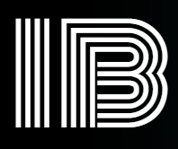

# Personal Portfolio - Iviwe Booi



A modern, responsive personal portfolio website showcasing my skills, projects, and professional journey as a software developer.

## 🌟 Live Demo

[View Live Portfolio](https://your-portfolio-url.netlify.app)

## 📋 Table of Contents

- [About](#about)
- [Features](#features)
- [Technologies Used](#technologies-used)
- [Project Structure](#project-structure)
- [Getting Started](#getting-started)
- [Deployment](#deployment)
- [Contact Form Setup](#contact-form-setup)
- [Customization](#customization)
- [Contributing](#contributing)
- [License](#license)

## 🎯 About

This portfolio website represents my journey as a software developer and final-year Computer Science student at the University of Cape Town (UCT). It showcases my technical skills, projects, certifications, and provides a professional platform for potential employers and collaborators to learn about my work.

### Key Highlights:
- **Modern Design**: Clean, professional interface with smooth animations
- **Responsive Layout**: Optimized for all devices and screen sizes
- **Interactive Elements**: Custom cursor, smooth scrolling, and dynamic content
- **Contact Integration**: Functional contact form using EmailJS
- **Project Showcase**: Detailed project presentations with videos and descriptions

## ✨ Features

### 🎨 Design & UX
- **Custom Cursor**: Smooth animated cursor that follows mouse movement
- **Smooth Scrolling**: Seamless navigation between sections
- **Responsive Design**: Mobile-first approach with breakpoint optimization
- **Modern Animations**: Subtle transitions and hover effects
- **Professional Typography**: Clean, readable font hierarchy

### 📱 Sections
- **Landing Page**: Compelling introduction with call-to-action buttons
- **About Me**: Personal story and professional background
- **Projects**: Showcase of technical projects with videos and descriptions
- **Certifications**: Professional certifications and achievements
- **FAQs**: Common questions about my work and experience
- **Contact**: Professional contact form and social links

### 🔧 Functionality
- **Contact Form**: Integrated EmailJS for reliable email delivery
- **Resume Download**: Direct download link for my CV
- **Social Links**: Professional social media integration
- **Mobile Menu**: Hamburger menu for mobile navigation
- **SEO Optimized**: Meta tags and semantic HTML structure

## 🛠️ Technologies Used

### Frontend
- **HTML5**: Semantic markup and structure
- **CSS3**: Modern styling with Flexbox and Grid
- **JavaScript (ES6+)**: Interactive functionality and animations
- **EmailJS**: Contact form integration

### Deployment & Hosting
- **Netlify**: Static site hosting and deployment
- **Git**: Version control and collaboration

### Design & Assets
- **Custom Icons**: SVG icons for consistent design
- **Optimized Images**: Compressed images for fast loading
- **Video Content**: Project demonstration videos

## 📁 Project Structure

```
Personal Portfolio/
├── assets/
│   ├── files/
│   │   └── resume.pdf
│   ├── icons/
│   │   ├── arrow-down.svg
│   │   ├── arrow-up.svg
│   │   ├── github.svg
│   │   ├── linkedin.svg
│   │   └── ... (other icons)
│   ├── images/
│   │   ├── myLogo.png
│   │   ├── me.jpeg
│   │   ├── gradient.png
│   │   └── ... (other images)
│   └── videos/
│       ├── calculator.mp4
│       ├── weatherApp.mp4
│       └── ... (project videos)
├── css/
│   ├── styles.css
│   └── media-queries.css
├── js/
│   ├── config.js
│   ├── handleForm.js
│   └── utils.js
├── index.html
├── netlify.toml
├── .gitignore
└── README.md
```

## 🚀 Getting Started

### Prerequisites
- A modern web browser
- Git (for version control)
- Text editor (VS Code, Sublime Text, etc.)

### Installation

1. **Clone the repository**
   ```bash
   git clone https://github.com/yourusername/personal-portfolio.git
   cd personal-portfolio
   ```

2. **Open the project**
   ```bash
   # Open index.html in your browser
   # Or use a local server for development
   python -m http.server 8000
   # or
   npx serve .
   ```

3. **Customize the content**
   - Update personal information in `index.html`
   - Replace images in `assets/images/`
   - Modify styling in `css/styles.css`
   - Update JavaScript functionality in `js/` files

## 🌐 Deployment

### Netlify Deployment

1. **Connect to Netlify**
   - Push your code to GitHub
   - Connect your repository to Netlify
   - Configure build settings (publish directory: `.`)

2. **Environment Variables**
   Set up the following environment variables in Netlify:
   ```
   EMAILJS_PUBLIC_KEY=your_emailjs_public_key
   EMAILJS_SERVICE_ID=your_emailjs_service_id
   EMAILJS_TEMPLATE_ID=your_emailjs_template_id
   ```

3. **Deploy**
   - Netlify will automatically deploy on every push to main branch
   - Your site will be available at `https://your-site-name.netlify.app`

### Manual Deployment
- Upload all files to your web hosting provider
- Ensure all file paths are correct
- Test the contact form functionality

## 📧 Contact Form Setup

### EmailJS Configuration

1. **Create EmailJS Account**
   - Sign up at [EmailJS](https://www.emailjs.com/)
   - Create a new email service (Gmail, Outlook, etc.)

2. **Create Email Template**
   ```html
   Subject: New Contact from Portfolio
   
   Name: {{name}}
   Email: {{email}}
   Message: {{message}}
   ```

3. **Configure Environment Variables**
   - Add your EmailJS credentials to Netlify environment variables
   - Update `js/config.js` with your configuration

4. **Test the Form**
   - Ensure emails are being sent correctly
   - Check spam folder for test emails

## 🎨 Customization

### Personal Information
- Update name, title, and description in `index.html`
- Replace profile image in `assets/images/me.jpeg`
- Update resume in `assets/files/resume.pdf`

### Styling
- Modify colors in `css/styles.css`
- Update fonts and typography
- Adjust animations and transitions

### Projects
- Add new projects to the projects section
- Include project videos in `assets/videos/`
- Update project descriptions and links

### Social Links
- Update social media URLs in the contact section
- Add or remove social platforms as needed

## 🤝 Contributing

While this is a personal portfolio, I welcome feedback and suggestions:

1. Fork the repository
2. Create a feature branch (`git checkout -b feature/AmazingFeature`)
3. Commit your changes (`git commit -m 'Add some AmazingFeature'`)
4. Push to the branch (`git push origin feature/AmazingFeature`)
5. Open a Pull Request

## 📄 License

This project is licensed under the MIT License - see the [LICENSE](LICENSE) file for details.

## 📞 Contact

- **Email**: booiiviwe4394@gmail.com
- **LinkedIn**: [Your LinkedIn Profile]
- **GitHub**: [Your GitHub Profile]
- **Portfolio**: [Your Portfolio URL]

---

⭐ **Star this repository if you found it helpful!**

*Built with ❤️ by Iviwe Booi* 